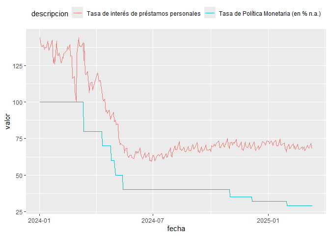

# Datos del Banco Central de la República Argentina (BCRA)

<br>

**NO OFICIAL: el paquete no es un producto oficial de la entidad**

## Descripción

Este paquete permite acceder a algunos de los datos publicados por el
Banco Central de la República Argentina (BCRA) y trabajar con ellos en
el entorno de R.

Al momento se pueden consultar los datos de la API Principales Variables
(<https://www.bcra.gob.ar/BCRAyVos/catalogo-de-APIs-banco-central.asp>)
y del informe mensual de la volución del Mercado de Cambios y Balance
Cambiario
(<https://www.bcra.gob.ar/PublicacionesEstadisticas/Mercado_de_cambios.asp>)

Algunas de sus funciones son:

- **`get_datasets()`**: Consulta las series disponibles en la API

- **`get_bcra()`**: Obtiene las series desaeadas con un período de
  tiempo elegido, en formato dataframe

- **`get_mercado_cambios()`**: Obtiene los datos del Informe mensual de
  la volución del Mercado de Cambios y Balance Cambiario

## Instalación

Para instalar el paquete, correr el siguiente código

``` r
# install.packages('devtools')
# si no tiene instalado devtools

devtools::install_github("jurricariet/bcraR")
```

## Modo de uso

Ejemplo de consulta a los datos de la API, para obtener los códigos de
las variables.

``` r
# Cargo la libreria
library(bcraR)

# Consulta de series relacionadas con las tasas de interés

tasas <- get_datasets(
  pattern = 'tasa' # Patrón de búsqueda
  ) # Por defecto, se muestran todas las series de esta API

head(tasas)
#>    status id_variable
#> 4     200           6
#> 7     200           9
#> 8     200          10
#> 9     200          11
#> 10    200          12
#> 11    200          13
#>                                                                                       descripcion
#> 4                                                          Tasa de Política Monetaria (en % n.a.)
#> 7  Tasas de interés de las operaciones de pase activas para el BCRA, a 1 día de plazo (en % n.a.)
#> 8  Tasas de interés de las operaciones de pase pasivas para el BCRA, a 1 día de plazo (en % n.a.)
#> 9         Tasas de interés por préstamos entre entidades financiera privadas (BAIBAR) (en % n.a.)
#> 10         Tasas de interés por depósitos a 30 días de plazo en entidades financieras (en % n.a.)
#> 11                                 Tasa de interés de préstamos por adelantos en cuenta corriente
#>                categoria      fecha valor
#> 4  Principales Variables 2025-03-13 29.00
#> 7  Principales Variables 2025-03-14 33.00
#> 8  Principales Variables 2024-07-19 40.00
#> 9  Principales Variables 2025-03-12 32.80
#> 10 Principales Variables 2025-03-12 27.48
#> 11 Principales Variables 2025-03-12 34.90
```

Ejemplo de consulta de las series de *tasa de política monetaria* y
*tasa de préstamos personales* desde enero 2024 hasta la actualidad

``` r


data <- get_bcra(id_vars = c(6,14),
                 start_date = '2024-01-01',
                 end_date = Sys.Date())

head(data)
#>   idVariable      fecha valor
#> 1          6 2025-03-13    29
#> 2          6 2025-03-12    29
#> 3          6 2025-03-11    29
#> 4          6 2025-03-10    29
#> 5          6 2025-03-07    29
#> 6          6 2025-03-06    29
```

Gráfico:

``` r
library(tidyverse)

data %>% 
  left_join(tasas %>% select(id_variable,descripcion),
            by=c('idVariable'='id_variable')) %>% # Tomo el nombre de la variable de la tabla de series disponibles
  ggplot(aes(x=fecha, y=valor, color=descripcion)) +
  geom_line() +
  theme(legend.position = 'top') 
```


