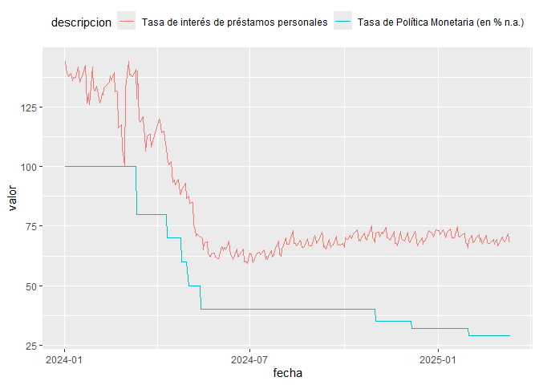

# Paquete para acceder a los datos del Banco Central de la República Argentina (BCRA)

\*\* NO OFICIAL: el paquete no es un producto oficial de la entidad \*\*

## Descripción

Este paquete permite acceder a algunos de los datos publicados por el
Banco Central de la República Argentina (BCRA) y trabajar con ellos en
el entorno de R.

Al momento se pueden consultar los datos de la API Principales Variables
(<https://www.bcra.gob.ar/BCRAyVos/catalogo-de-APIs-banco-central.asp>)
y del informe mensual de la volución del Mercado de Cambios y Balance
Cambiario
(<https://www.bcra.gob.ar/PublicacionesEstadisticas/Mercado_de_cambios.asp>)

Algunas de sus funciones son:

- **`get_dataset()`**: Consulta las series disponibles en la API,

- **`get_bcra()`**: Obtiene las series desaeadas con un período de
  tiempo elegido, en formato dataframe

- **`get_mercado_cambios()`**: Obtiene los datos del Informe mensual de
  la volución del Mercado de Cambios y Balance Cambiario

## Instalación

Para instalar el paquete, correr el siguiente código

``` r
# install.packages('devtools')
# si no tiene instalado devtools

devtools::install_github("jurricariet/bcraR")
```

## Modo de uso

Ejemplo de consulta a los datos de la API, para obtener los códigos de
las variables.

``` r
# Cargo la libreria
library(bcraR)

# Consulta de series relacionadas con las tasas de interés

tasas <- get_datasets(
  pattern = 'tasa' # Patrón de búsqueda
  ) # Por defecto, se muestran todas las series de esta API

tasas
#>     status id_variable
#> 4      200           6
#> 7      200           9
#> 8      200          10
#> 9      200          11
#> 10     200          12
#> 11     200          13
#> 12     200          14
#> 30     200          34
#> 33     200          41
#> 35     200          43
#> 120    200         128
#> 121    200         129
#> 122    200         130
#> 123    200         131
#> 124    200         132
#> 125    200         133
#> 126    200         134
#> 136    200         144
#> 137    200         145
#> 138    200         146
#> 140    200         148
#> 142    200         150
#> 152    200         160
#> 153    200         161
#> 154    200         162
#> 155    200         163
#> 156    200         164
#> 157    200         165
#> 158    200         166
#> 159    200         167
#> 160    200         168
#> 161    200         169
#> 162    200         170
#> 163    200         171
#> 164    200         172
#> 165    200         173
#> 166    200         174
#> 167    200         175
#> 168    200         176
#> 169    200         177
#> 170    200         178
#> 171    200         179
#> 172    200         180
#> 173    200         181
#> 174    200         182
#> 175    200         183
#> 176    200         184
#> 177    200         185
#> 178    200         186
#> 179    200         187
#> 180    200         188
#> 181    200         189
#> 182    200         190
#> 187    200         195
#>                                                                                                                                                 descripcion
#> 4                                                                                                                    Tasa de Política Monetaria (en % n.a.)
#> 7                                                            Tasas de interés de las operaciones de pase activas para el BCRA, a 1 día de plazo (en % n.a.)
#> 8                                                            Tasas de interés de las operaciones de pase pasivas para el BCRA, a 1 día de plazo (en % n.a.)
#> 9                                                                   Tasas de interés por préstamos entre entidades financiera privadas (BAIBAR) (en % n.a.)
#> 10                                                                   Tasas de interés por depósitos a 30 días de plazo en entidades financieras (en % n.a.)
#> 11                                                                                           Tasa de interés de préstamos por adelantos en cuenta corriente
#> 12                                                                                                                  Tasa de interés de préstamos personales
#> 30                                                                                                                   Tasa de Política Monetaria (en % e.a.)
#> 33                                                           Tasas de interés de las operaciones de pase pasivas para el BCRA, a 1 día de plazo (en % e.a.)
#> 35                                                                    Tasa de interés para uso de la Justicia – Comunicado P 14290 | Base 01/04/1991 (en %)
#> 120                                                     Tasa de interés de depósitos a plazo fijo en pesos, de 30-44 días , total de operaciones,TNA (en %)
#> 121                                                           Tasa de interés de depósitos a plazo fijo en pesos, de 30-44 días, hasta $100.000, TNA (en %)
#> 122                                                           Tasa de interés de depósitos a plazo fijo en pesos, de 30-44 días, hasta $100.000, TEA (en %)
#> 123                                                     Tasa de interés de depósitos a plazo fijo en pesos, de 30-44 días, de más de $1.000.000, TNA (en %)
#> 124                                                   Tasa de interés de depósitos a plazo fijo en dólares, de 30-44 días, total de operaciones, TNA (en %)
#> 125                                                         Tasa de interés de depósitos a plazo fijo en dólares, de 30-44 días, hasta $100.000, TNA (en %)
#> 126                                                 Tasa de interés de depósitos a plazo fijo en dólares, de 30-44 días, de mas de USD1.000.000, TNA (en %)
#> 136                                                                                            Tasa de interés de préstamos personales en pesos, TNA (en %)
#> 137 Tasa de interés por adelantos en cuenta corriente en pesos, con acuerdo de 1 a 7 días y de 10 millones o más, a empresas del sector privado, TNA (en %)
#> 138                                           Tasa de interés por operaciones de préstamos entre entidades financieras locales privadas (BAIBAR, TNA, en %)
#> 140                                                            Tasa de interes por operaciones de préstamos entre entidades financieras locales, TNA (en %)
#> 142                                                                             Tasa de interes por operaciones de pases entre terceros a 1 día, TNA (en %)
#> 152                                                                                                      Tasas de interés de política monetaria, TNA (en %)
#> 153                                                                                                      Tasas de interés de política monetaria, TEA (en %)
#> 154                                                                               Tasas de interés del BCRA para pases pasivos en pesos a 1 día, TNA (en %)
#> 155                                                                              Tasas de interés del BCRA para pases pasivos en pesos a 7 días, TNA (en %)
#> 156                                                                              Tasas de interés del BCRA para pases activos en pesos a 1 días, TNA (en %)
#> 157                                                                              Tasas de interés del BCRA para pases activos en pesos a 7 días, TNA (en %)
#> 158                                                                                         Tasas de interés de LEBAC en Pesos / LELIQ de 1 mes, TNA (en %)
#> 159                                                                                               Tasas de interés de LEBAC en Pesos de 2 meses, TNA (en %)
#> 160                                                                                               Tasas de interés de LEBAC en Pesos de 3 meses, TNA (en %)
#> 161                                                                                               Tasas de interés de LEBAC en Pesos de 4 meses, TNA (en %)
#> 162                                                                                               Tasas de interés de LEBAC en Pesos de 5 meses, TNA (en %)
#> 163                                                                                        Tasas de interés de LEBAC en Pesos / LELIQ a 6 meses, TNA (en %)
#> 164                                                                                               Tasas de interés de LEBAC en Pesos de 7 meses, TNA (en %)
#> 165                                                                                               Tasas de interés de LEBAC en Pesos de 8 meses, TNA (en %)
#> 166                                                                                               Tasas de interés de LEBAC en Pesos de 9 meses, TNA (en %)
#> 167                                                                                              Tasas de interés de LEBAC en Pesos de 10 meses, TNA (en %)
#> 168                                                                                              Tasas de interés de LEBAC en Pesos de 11 meses, TNA (en %)
#> 169                                                                                              Tasas de interés de LEBAC en Pesos de 12 meses, TNA (en %)
#> 170                                                                                              Tasas de interés de LEBAC en Pesos de 18 meses, TNA (en %)
#> 171                                                                                              Tasas de interés de LEBAC en Pesos de 24 meses, TNA (en %)
#> 172                                                                            Tasas de interés de LEBAC en pesos ajustables por CER de 6 meses, TNA (en %)
#> 173                                                                           Tasas de interés de LEBAC en pesos ajustables por CER de 12 meses, TNA (en %)
#> 174                                                                           Tasas de interés de LEBAC en pesos ajustables por CER de 18 meses, TNA (en %)
#> 175                                                                           Tasas de interés de LEBAC en pesos ajustables por CER de 24 meses, TNA (en %)
#> 176                                                                    Tasas de interés de LEBAC en dólares, con liquidación en pesos, de 1 mes, TNA (en %)
#> 177                                                                  Tasas de interés de LEBAC en dólares, con liquidación en pesos, de 6 meses, TNA (en %)
#> 178                                                                 Tasas de interés de LEBAC en dólares, con liquidación en pesos, de 12 meses, TNA (en %)
#> 179                                                                  Tasas de interés de LEBAC en dólares, con liquidación en dólares, de 1 mes, TNA (en %)
#> 180                                                                Tasas de interés de LEBAC en dólares, con liquidación en dólares, de 3 meses, TNA (en %)
#> 181                                                                Tasas de interés de LEBAC en dólares, con liquidación en dólares, de 6 meses, TNA (en %)
#> 182                                                               Tasas de interés de LEBAC en dólares, con liquidación en dólares, de 12 meses, TNA (en %)
#> 187                                                                          Margen sobre Tasa de Politica Monetaria de NOTALIQ en Pesos de 190 dias (en %)
#>                 categoria      fecha      valor
#> 4   Principales Variables 2025-03-13    29.0000
#> 7   Principales Variables 2025-03-14    33.0000
#> 8   Principales Variables 2024-07-19    40.0000
#> 9   Principales Variables 2025-03-12    32.8000
#> 10  Principales Variables 2025-03-12    27.4800
#> 11  Principales Variables 2025-03-12    34.9000
#> 12  Principales Variables 2025-03-12    68.1300
#> 30  Principales Variables 2025-03-13    33.6300
#> 33  Principales Variables 2024-07-19    49.1500
#> 35  Principales Variables 2025-03-14 18753.0714
#> 120           Series.xlsm 2025-03-12    28.6219
#> 121           Series.xlsm 2025-03-12    27.5400
#> 122           Series.xlsm 2025-03-12    31.2755
#> 123           Series.xlsm 2025-03-12    28.6500
#> 124           Series.xlsm 2025-03-12     0.6170
#> 125           Series.xlsm 2025-03-12     0.5600
#> 126           Series.xlsm 2025-03-12     0.7500
#> 136           Series.xlsm 2025-03-12    68.1300
#> 137           Series.xlsm 2025-03-12    34.9000
#> 138           Series.xlsm 2025-03-12    32.8000
#> 140           Series.xlsm 2025-03-12    32.5600
#> 142           Series.xlsm 2025-03-12    31.4280
#> 152           Series.xlsm 2025-03-12    29.0000
#> 153           Series.xlsm 2025-03-12    33.6300
#> 154           Series.xlsm 2024-07-19    40.0000
#> 155           Series.xlsm 2022-02-04    32.0000
#> 156           Series.xlsm 2025-03-12    33.0000
#> 157           Series.xlsm 2025-03-12    33.0000
#> 158           Series.xlsm 2018-11-21    49.9967
#> 159           Series.xlsm 2018-10-17    57.0005
#> 160           Series.xlsm 2018-09-19    45.0003
#> 161           Series.xlsm 2018-07-19    42.3501
#> 162           Series.xlsm 2018-05-16    37.9999
#> 163           Series.xlsm 2023-07-05   105.5000
#> 164           Series.xlsm 2018-03-21    25.2499
#> 165           Series.xlsm 2017-01-31    21.9001
#> 166           Series.xlsm 2018-03-21    24.9500
#> 167           Series.xlsm 2017-01-31    21.7423
#> 168           Series.xlsm 2014-12-02    29.1875
#> 169           Series.xlsm 2015-03-17    29.4619
#> 170           Series.xlsm 2007-07-17    10.6000
#> 171           Series.xlsm 2013-02-13    16.9581
#> 172           Series.xlsm 2003-03-20     7.8788
#> 173           Series.xlsm 2005-07-19     0.0000
#> 174           Series.xlsm 2005-07-19     0.8000
#> 175           Series.xlsm 2005-07-19     1.2000
#> 176           Series.xlsm 2006-01-03     4.1497
#> 177           Series.xlsm 2015-12-16     3.6500
#> 178           Series.xlsm 2016-01-29     3.6500
#> 179           Series.xlsm 2016-04-26     0.8997
#> 180           Series.xlsm 2016-04-26     0.9001
#> 181           Series.xlsm 2016-01-05     3.1251
#> 182           Series.xlsm 2016-01-05     3.1250
#> 187           Series.xlsm 2023-09-13     2.5000
```

Ejemplo de consulta de las series de *tasa de política monetaria* y
*tasa de préstamos personales* desde enero 2024 hasta la actualidad

``` r


data <- get_bcra(id_vars = c(6,14),
                 start_date = '2024-01-01',
                 end_date = Sys.Date())

head(data)
#>   idVariable      fecha valor
#> 1          6 2025-03-13    29
#> 2          6 2025-03-12    29
#> 3          6 2025-03-11    29
#> 4          6 2025-03-10    29
#> 5          6 2025-03-07    29
#> 6          6 2025-03-06    29
```

Gráfico:

``` r
library(tidyverse)
#> ── Attaching core tidyverse packages ──────────────────────── tidyverse 2.0.0 ──
#> ✔ dplyr     1.1.4     ✔ readr     2.1.5
#> ✔ forcats   1.0.0     ✔ stringr   1.5.1
#> ✔ ggplot2   3.5.1     ✔ tibble    3.2.1
#> ✔ lubridate 1.9.3     ✔ tidyr     1.3.1
#> ✔ purrr     1.0.2     
#> ── Conflicts ────────────────────────────────────────── tidyverse_conflicts() ──
#> ✖ dplyr::filter() masks stats::filter()
#> ✖ dplyr::lag()    masks stats::lag()
#> ℹ Use the conflicted package (<http://conflicted.r-lib.org/>) to force all conflicts to become errors

data %>% 
  left_join(tasas %>% select(id_variable,descripcion),
            by=c('idVariable'='id_variable')) %>% # Tomo el nombre de la variable de la tabla de series disponibles
  ggplot(aes(x=fecha, y=valor, color=descripcion)) +
  geom_line() +
  theme(legend.position = 'top') 
```


